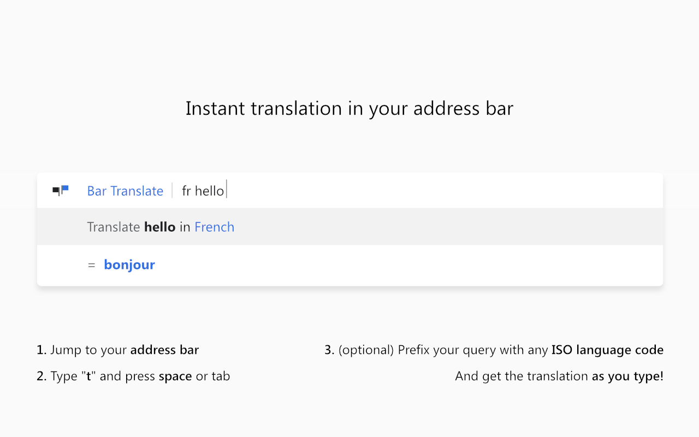
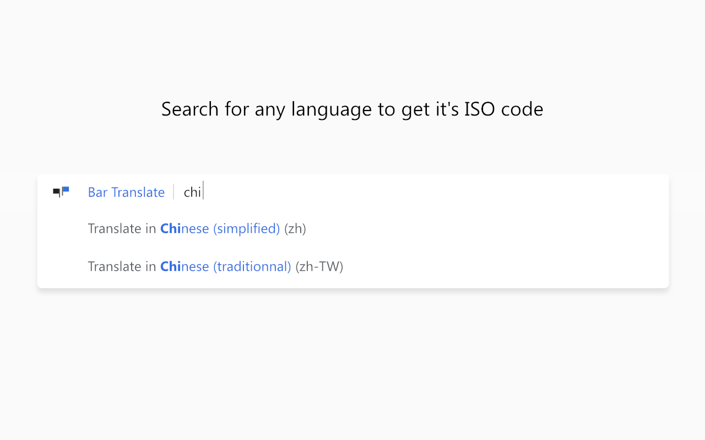
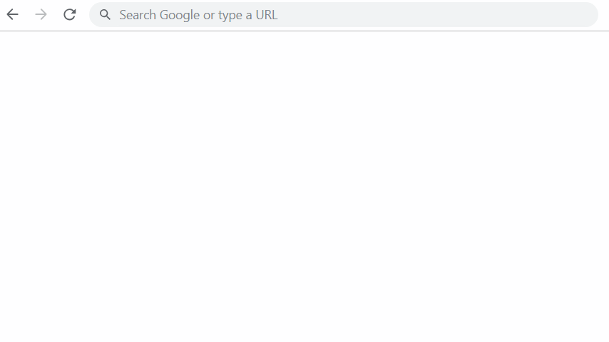

# Bar Translate

Bar Translate is a modern Chrome extension that allows you to translate anything directly from the address bar (Omnibox).

## Features
- Translate directly from the Chrome Omnibox
- Quick language selection: e.g. `t tr Hello` or `t en Merhaba`
- Automatic browser language detection
- Modern UI and enhanced user experience
- Comprehensive settings and help page

## Installation
1. [Install from Chrome Web Store](https://chrome.google.com/webstore/) *(will be updated after approval)*
2. Type `t` in the address bar, press `Tab` or `Space`, and enter the text you want to translate.
3. Check `options` to change the languages.

## Screenshots

### Omnibox Usage

### Popup Interface

### Quick Tour

## Demo Videos
- [Usage Video (MP4)](assets/basic.mp4)
- [Usage Video (WebM)](assets/basic.webm)

## Developer
- **Burak Kanmaz**
- License: MIT

## Contributing
Pull requests and suggestions are welcome.

## Inspiration & Credits
The original idea for this project was inspired by [maximelebreton](https://github.com/maximelebreton/). However, this version includes extensive modifications and modernization.
